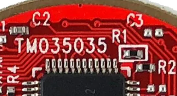
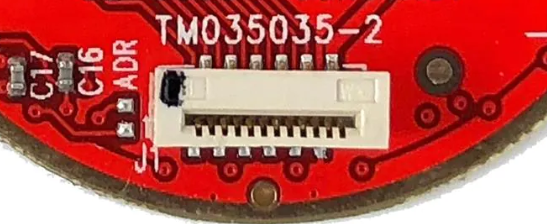
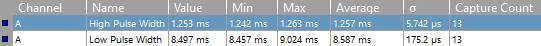
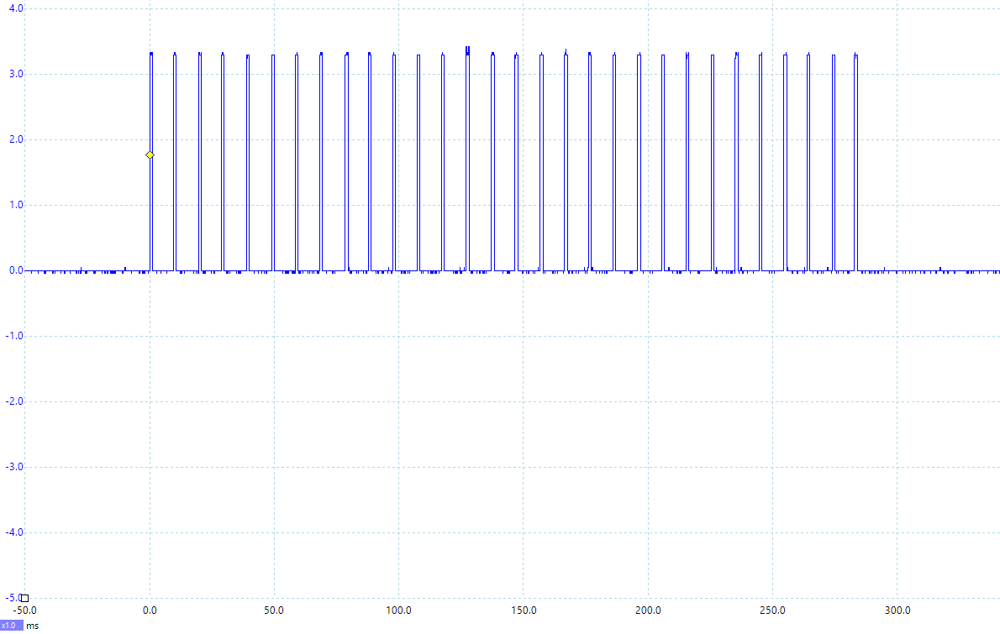

# Cirque Pinnacle Arduino Lib

## Intro

This library is meant to facilitate the use of a Cirque GlidePoint trackpad. In this case, specifically ones using the Gen3 (or Gen2?) Pinnacle ASIC.

## Status

The (known) existing bugs have been eliminated. Feel free to try the code.

**Recent Changes**:

* I added the cirque_plot.ino sketch that plots your trackpad data so you can easily see the ranges and behavior of your trackpad.

* **Major changes** incurred by:
  * adding Interrupt Service Routines supporting up to (4) devices
  * joining the Absolute and Relative data decodes into one structure and unifying calls that were for separate data types.
  * general changes in the cirque_demo.ino sketch that support multiple trackpads, and comment blocks discussing SPI vs. I2C and ISR use. Separate READEME files will accompany the demo sketch and the CirquePinnacle library code.

* I added a Set_Speed() method to allow better synchronization with applications that will access the data at a slower rate that could provide better Relative data or more current Absolute data.
* I added a Button_Decode() method the break out the button names for a good column-based disaply.
* I added Set_Config_Values() to provided a better way to apply configuration setting. This is my preferred method of setting up the device though the user has to do a bit more work.

## Data Notification

The Pinnacle provide a Data Ready (DR) signal either as a Status register flag (SW_DR) or as an active high hardware data line (HW_DR). The SW_DR flag sets the HW_DR line. You can either poll the I/O pin or the Data Ready flag in the Status register. You have to clear the DR flag in the Status register to drop the DR line  and enable the next data read. Neither DR signal is dropped on just a data read a data read like some devices. An interrupt driven model is in the works. to ensure that the latest Absolute data is available.

## Testing Hardware

I'm using a Cirque GlidePoint TM035035-2024 Pinnacle based circular trackpad to test with. My microcontroller is an Adafruit QT Py SAMD21 (product #[4600](https://www.adafruit.com/product/4600)) on a custom board with a FFC-12 connector for connecting to the trackpad. The QT Py accesses all 12 of the FFC lines.

## Interface Notes

SPI is recommended by Cirque as it is faster and easier to access multiple trackpads with the same controller.	

### I2C Notes

The default I2C address is 0x2A once resistor R1 is removed from the TM035035-2024's board to enable I2C operation. Doing so disables SPI operation. **Pull-up resistors are required for this trackpad!** - See my note in cirque_demo.ino. Other models may differ - one reference schematic does show 2.2kΩ pull-up resistors installed.



Per [CirquePinnacle.readthedocs.io](https://cirquepinnacle.readthedocs.io/en/latest/) "you could change the I2C address from `0x2A` to `0x2C` by soldering a 470KΩ resistor at the junction labeled ADR [address], although this is untested".



You could also use an I2C [multiplexor](https://www.adafruit.com/product/2717) that allows you to switch the I2C buss between different devices with the same address.

### SPI Notes

Unfortunately the latest code has not been tested with SPI because I converted my only trackpad to I2C (because  I'm so I2C-centric) not thinking that I'm the only person that would bother. The fact that there are no I2C pull-ups just adds to the futility of it all. But at least it still reads ... 0xFF - for everything - all the time. But I'm 98.3% sure it will work. I'll enlist the help of a tester that will hopefully give me the thumbs up, then I'll post an update.

## Trackpad Models

From [CirquePinnacle.readthedocs.io](https://cirquepinnacle.readthedocs.io/en/latest/).

Model TMyyyxxx-202i-cco decomposes to:

| Designator | Interpretation                                               |
| :--------: | ------------------------------------------------------------ |
|    yyy     | vertical width of the trackpad in millimeters                |
|    xxx     | horizontal width of the trackpad in millimeters              |
|     i      | interface: 3=I2C (470kΩ resistor at R1), 4=SPI               |
|     cc     | Custom configuration: 00=standard (no resistor at R4), 03=certain features are disabled (470kΩ resistor at R4) |
|     o      | overlay type: 0=none, 1=adhesive, 2=flat, 3=curved           |

Cirque’s circle trackpads ship with the newer non-AG (Advanced Gestures) variant of the Pinnacle touch controller ASIC.

Mouser has excellent hi-res photos available on their [search](https://mou.sr/3UCy1Wj) and product pages.

## example/../cirque_demo.ino

This example sketch will allow you to use either the SPI or I2C interface by changing a #define.

```c++
// Select the interface being used
#define USING_SPI
// #define USING_I2C
```

Next, set the SPI speed and which pins are being used.

```c++
// for my QT Cirque board with an Adafruit QT Py (#4600) MCU and an FFC-12 connector
#define SPI_SPEED_MAX       10e6

// for Trackpad 1 (TP1_)
#define TP1_SPI_SELECT_PIN  0    // SPI chip/slave select pin
#define TP1_DATA_READY_PIN  1    // or -1 if not wired (no ISR, uses SW_DR in Status register)
```

|     Macro      | Description                                                  |
| :------------: | ------------------------------------------------------------ |
| SPI_SELECT_PIN | This is the SPI Slave/Chip Select output line that connects to the Pinnacle's SS line which enables the Pinnacle to communicate on the SPI buss. |
| DATA_READY_PIN | This is the pin connected to the Pinnacle's DR (/Data Ready) active low output that signals when new feed data is ready. If this pin is not wired set the value to -1 (<0) to check the Status register DR flag instead. |
| SPI_SPEED_MAX  | This is the SPI clock speed that will be used for SPI communications. 10Mbps seems to be a good speed for current microcontrollers. |

Indicate if you want to use interrupts to read and decode the trackpad data. The Cirque's Data Ready line must be attached to a DATA_READY_PIN.

```c++
// True if using an Interrupt Service Routine (provided by CirquePinnacle)
bool using_isr = true;
```

Both Absolute and Relative data modes are supported (but not concurrently at this time).

```c++
// Select the preferred data mode, 1 or true for Absolute, 0 or false for Relative
data_mode_t data_mode = (1) ? DATA_MODE_ABS : DATA_MODE_REL;
```

## Files

| File                        | Description                                                  |
| --------------------------- | ------------------------------------------------------------ |
| CirquePinnacle.h            | The header file for the CirquePinnacle base class. It contains the Register and Flag definitions, and a few common register settings. |
| CirquePinnacle.cpp          | The implementation for everything except the interface code. |
| CirquePinnacleSPI.h         | Creates the child class CirquePinnacleSPI that will be the one instantiated most likely. |
| CirquePinnacleSPI.cpp       | Contains the Register Access Protocol (RAP) methods using SPI. |
| CirquePinnacleI2C.h         | Creates the child class CirquePinnacleI2C as an alternative to using SPI. |
| CirquePinnacleI2C.cpp       | Contains the Register Access Protocol (RAP) methods using I2C. |
| examples/../cirque_demo.ino | This **example sketch** creates an instance of a CirquePinnacle child class, then polls the DR line, reads and prints the data. |
| examples/../cirque_plot.ino | This **example sketch** plot the Absolute or Relative data on the Arduino IDE's Serial Plotter (under Tools or Ctrl-Shift-L). |

## Library/Driver Code

### Constructors

The constructors allow you to override default parameters that will be applied when begin() is called. These c'tors could be overloaded and the parameters altered or reorganized as needed in the future.

### Methods etc.

| Method                     | Description                                                  |
| -------------------------- | ------------------------------------------------------------ |
| begin()                    | Because it's an Arduino thing.                               |
| end()                      | Tears down ISR.                                              |
| Set_Config_Values()        | Set the feed 1 and 2 config register values that will be used when begin() is called. |
| Set_Speed()                | Allows you to set a sampling speed compatible with your application so you're not reading stale data. |
| Pinnacle_Init()            | Called by begin() to set the configuration registers. This method uses pre-configured values modified by constructor overrides. |
| Pinnacle_Init(disableFeed) | Called by begin() to set the configuration registers if the values have been set using Set_Config_Values(). |
| Get_Data()                 | Pass your structure by reference to read and decode the latest dataset when not using an ISR. |
| Start_ISR()                | Launch an Interrupt Service Routine to read and decode your data when available. |
| Clear_DR()                 | Clear your Data Ready flag set by the ISR after a data update. |
| End_ISR()                  | Disable ISR operation and resume polling.                    |
| ClearFlags()               | Called frequently to clear the CC and DR flags in the Status Register. |
| EnableFeed()               | Used to disable then re-enable the feed for certain operations. |
| ERA_ReadBytes()            | Read bytes from an Extended Register Address.                |
| ERA_WriteByte()            | Write to an Extended Register Address.                       |
| ClipCoordinates()          | Clips raw coordinates to "reachable" window of sensor.       |
| ScaleData()                | Scales data to desired X & Y resolution.                     |
| Data_Ready()               | Check the Data Ready line for new data. If the DR lines is not wired, the DR flag in the Status register is checked. |
| Invert_Y()                 | Inverts the Y-Axis. Now better implemented with the c'tor override or the Set_Config_Values() method. |
| Get_ID()                   | Retrieves the chip and firmware version, and the product ID. (*) |
| Button_Decode              | Decodes the button status into a String for display.         |
| **STATIC FUNCTIONS**       |                                                              |
| Read_Data_ISR_0-4()        | ISRs bound to a unique ISR number that indexes a unique data structure. |
| Read_Data_ISR()            | A common routine called by ISR_0-3 to read and decode the trackpad data. |
| Decode_Data()              | Decodes the XYZ data from the raw data.                      |
| **UTILITY FUNCTIONS**      |                                                              |
| SetFlag()                  | A utility routine for setting and clearing flags in a register word. |

\* I could not find a lookup-table for any of these values. I get:

```
Chip ID:0x7 Firmware Version:0x3A Product ID:0x80
```

## Credit Where Credit is Due

I have to recognize the contributions of Cirque and to a greater extent Ryan Young for his comprehensive Cirque Pinnacle [code](https://github.com/ryanayoung/projectSpigot) on GitHub. I've only scratched the surface with my implementation - but that's probably good enough for now.

## ToDo

* Code the destructor(s) to disable and free the ISR.

## Timing

With no delay() calls and the data feed running at the max rate of 100 samples/second (10ms), data acquisition is very responsive with most of the time spent waiting for new data. This is a measurement of the DR line spent high vs. low. This is using the slower I2C interface.

If you're using a faster sampling speed than you application can handle, a new sample may be ready shortly after you read your data and clear the SW_DR flag. If you're using the default 10ms sampling period but you don't check the data but every 100ms, your data could be 90ms old. The next reading would have been latched by the DR flag until you get around to clearing it. It's better to sync the data reads to your application, particularly if you're reading Relative data.

I'm working on an interrupt driven model that will fetch the data as soon as it's ready. It  would overwrite old data so it's better suited to Relative data unless a matching sampling speed was set. It supports multiple trackpads for MIDI use.



and a scope trace (50ms divisions, Absolute data mode).



## Notes on Style

### Streaming

If your Arduino Library Manager stops finding the Steaming lib or you want to see the documentation, get it [here](https://github.com/janelia-arduino/Streaming). If you cringe because you don't like iostream or round planets feel free to replace the prints with 17.3k Serial.print() calls.

### Engineering Notation

For timing and clock parameters I tend to use exponent notation, e.g., delay(5e3) for a 5 second delay.

### Coding Style

Yes, I like K&R style, aligned columns, mixed Camel-lower-whatever ...  I'm not going to run it through a code-uglifier just to make the robots happy. I have to look at this stuff.	
